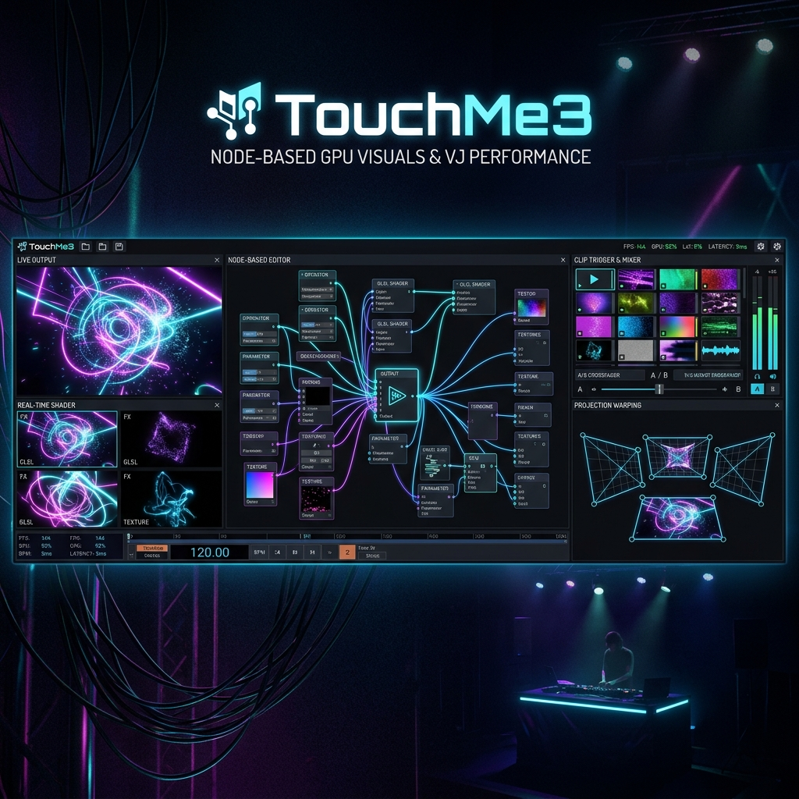

# TouchMe3 🚀



**TouchMe3** is a high-performance, real-time node-based VJ software and GPU visual processing engine built with C++, JUCE, OpenGL/Direct2D, and FFmpeg.

Designed for live VJ performances, projection mapping, visual synthesis, and interactive installations.

---

## ✨ Features

- 🎨 **Node-Based Processing Engine**: Modular node graph layout featuring color controls, noise generators, edge detection, displacement, GLSL ShaderToy node integration, envelopes, and more.
- 🎛️ **MIDI & OSC Control**: Full hardware mapping capabilities for MIDI controllers and OSC network control.
- 📐 **Advanced Output Warping**: Multi-display projector warping, edge blending, and grid transformations.
- 📼 **Hardware Accelerated Media Playback**: Native high-speed decoding powered by FFmpeg.
- ⚡ **Real-Time GLSL Shader Support**: Live editing and execution of customized GLSL visual shaders.

---

## 🛠️ Build Requirements

- **C++ Compiler**: C++17 compatible (MSVC / GCC / Clang)
- **CMake**: Version `3.22` or higher
- **Frameworks & Libraries**:
  - [JUCE 7](https://github.com/juce-framework/JUCE) *(automatically fetched via CMake)*
  - [foleys_video_engine](https://github.com/ffAudio/foleys_video_engine) *(automatically fetched via CMake)*
  - **FFmpeg 5.1+ Shared Binaries** *(automatically downloaded on Windows build)*

---

## 🚀 Getting Started

### 1. Clone the Repository
```bash
git clone https://github.com/The-Rocketship/TouchMe3.git
cd TouchMe3
```

### 2. Configure & Build with CMake
```bash
mkdir build
cd build
cmake ..
cmake --build . --config Release
```

---

## 📜 License

Private Repository - Copyright (c) The Rocketship. All rights reserved.
